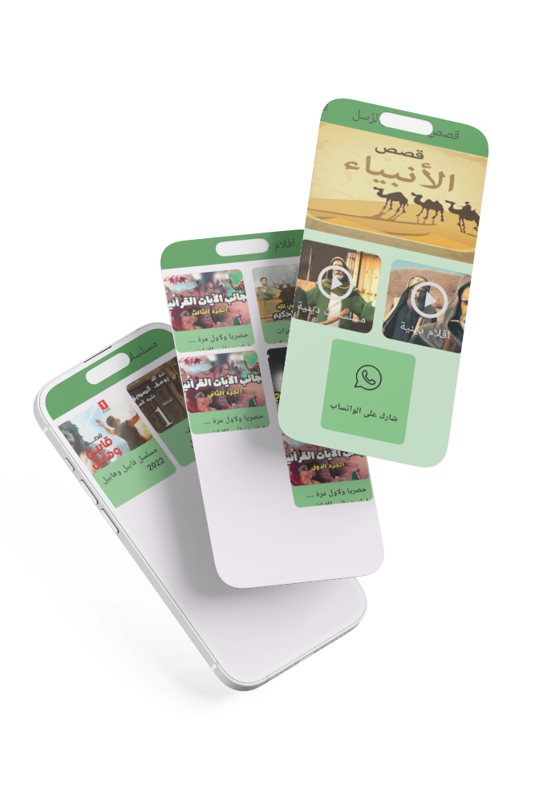
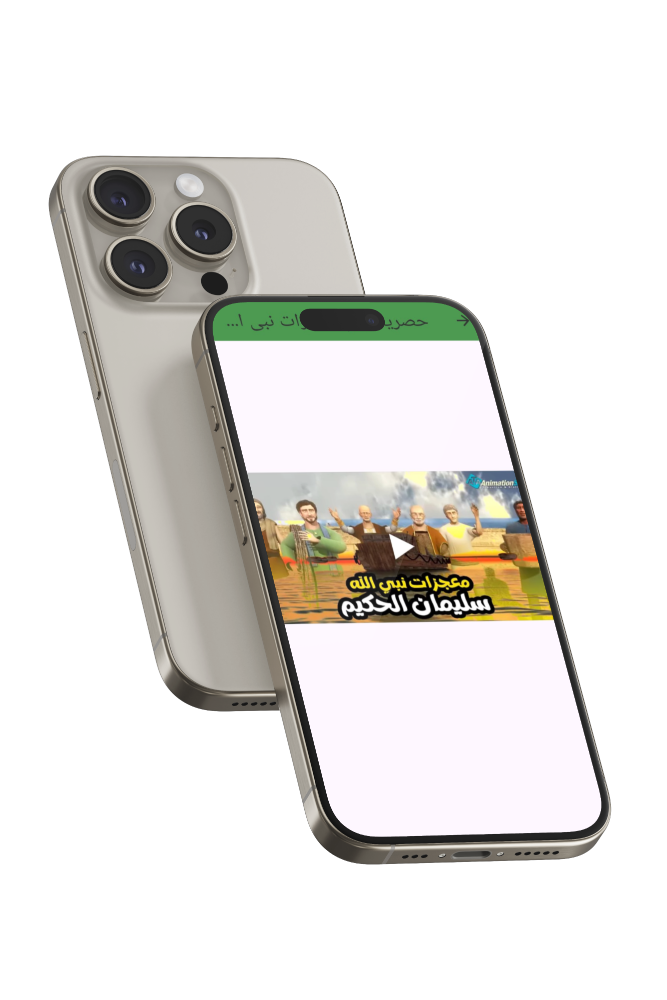
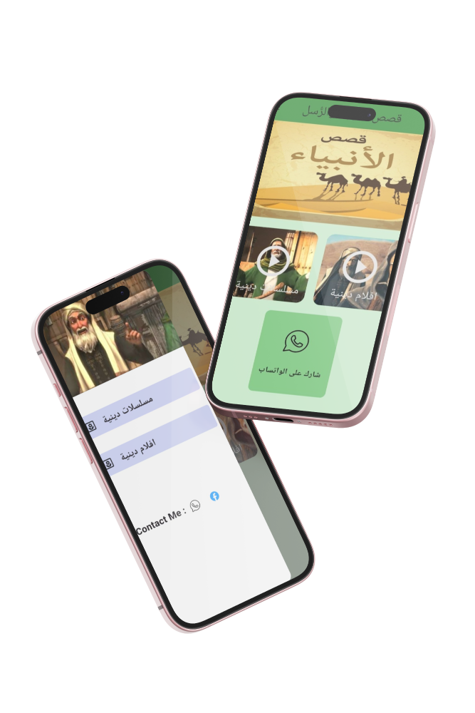

# قصص الانبياء (Prophet Stories)


## Table of Contents
- [Overview](#overview)
- [Features](#features)
- [Technologies Used](#technologies-used)
- [Setup and Installation](#setup-and-installation)
- [Usage](#usage)
- [Snapshots](#snapshots)
- [Contributing](#contributing)
- [License](#license)

## Overview
"قصص الانبياء" (Prophet Stories) is a mobile application designed to provide users with a collection of series and films about the stories of the Prophets. The app leverages Firebase for data storage and management, ensuring a seamless and reliable user experience.

## Features
- **Series and Films**: Access a variety of series and films about the stories of the Prophets.
- **Firebase Integration**: Store and manage data using Firebase Database and Firestore.
- **Generic Cubit**: Utilize a general generic cubit for state management across the entire application.
- **YouTube Video Player**: Play video links directly from YouTube within the app.
- **Multilingual Support**: Initially supports Arabic, with plans for additional languages in future updates.

## Technologies Used
- **Flutter**: For building the cross-platform mobile application.
- **Firebase**: For backend services including real-time database and Firestore.
- **Cubit (Bloc)**: For state management.
- **YouTube Video Player**: For embedding and playing YouTube videos within the app.

## Setup and Installation
1. **Clone the repository**
   ```sh
   git clone https://github.com/yourusername/prophet-stories.git
   cd prophet-stories

2. **Install dependencies**
   ```sh
   flutter pub get

### Configure Firebase
- **Follow the instructions to set up Firebase for your Flutter project: Firebase Setup**
- **Add your google-services.json (for Android) and GoogleService-Info.plist (for iOS) to the respective directories.**

   **Run the application**
   ```sh
   flutter run

### Usage
- **Launch the application on your device or emulator.**
- **Browse through the collection of series and films about the stories of the Prophets.**
- **Select a video to watch and it will play using the YouTube Video Player integrated within the app.**

### Snapshots
<table>
  <tr>
    <td>
      
    </td>
    <td>
      
    </td>
    <td>
      
    </td>
  </tr>
</table>


## License
- **This project is licensed under the MIT License - see the LICENSE file for details.**
